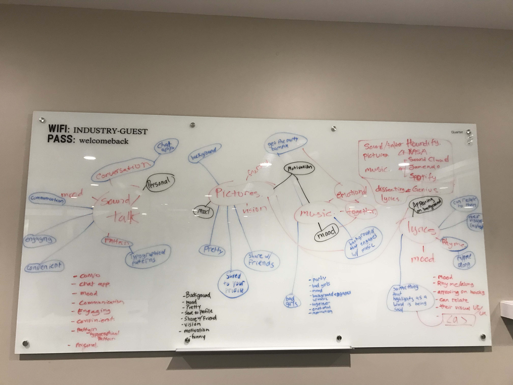
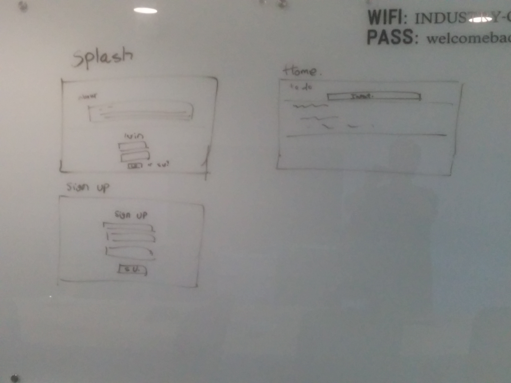

Project Group-4: Nest Ninjas

- Deployed app: https://lit-garden-88226.herokuapp.com/
- Trello board: https://trello.com/b/NxEL6DH5/group-project

For this project, we wanted to take a different route of getting ideas. We decided to based our app by looking at available APIs. We picked:

- Soundcloud
- Houdify
- NASA
- Jamendo
- Spotify

We picked Houndifiy at first, because we wanted to create a blog that can be created using talk commands.

After taking into account how many work days we actually have for this project, we took a completely different API:

- Talaikis

Talaikis API generates different random quote by different random people, and we used it as inpirational quote for out bloggers.

Division of workloads:

- Auburn: Skeleton of front-end and back-end
- Victor: APIs, front-end design
- Bart: Deploy, Secretary

We definitely learned a lot during this project and the most exciting thing about working on this project is that we actually reached a point where we can be somewhat comfortable before presentation time.

